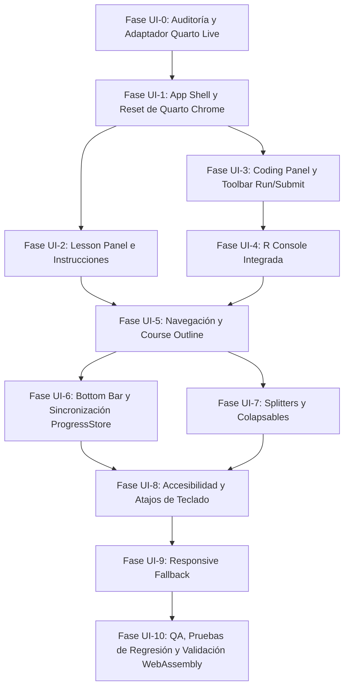

# Plan de Implementación: Social R Exercise Workspace (v0.2)
## Transformación de la Interfaz hacia un Entorno Educativo Full-Screen

- **Proyecto:** Social R
- **Objetivo:** Convertir la experiencia de lectura vertical actual en un **Workspace Educativo Full-Screen (100vw × 100vh)** para la enseñanza interactiva de R en Ciencias Sociales, reutilizando el motor validado Quarto Live + webR.
- **Autoría:** Arquitectura Frontend & UX Educativa
- **Fecha:** 2026-08-16
- **Estado:** Propuesto (Pendiente de Aprobación de Plan)

---

## 1. Visión y Principios de Diseño

### 1.1 El Concepto: "Laboratorio de R en el Navegador"
Social R v0.1 demostró la viabilidad técnica del motor (webR + Quarto Live + YAML). Sin embargo, su presentación inicial heredaba la estructura de documento web con scroll vertical.

La versión **v0.2** transformará Social R en un **espacio de trabajo de aprendizaje (Exercise Workspace)**:
1. **Zero Scroll de Página**: La aplicación ocupa `100vw × 100vh` fijos. Todo el scroll ocurre internamente en paneles delimitados e independientes.
2. **Pedagogía Split-Screen**: La teoría y las instrucciones conviven en paralelo con el editor y la consola, reduciendo la carga cognitiva y eliminando el salto constante de foco.
3. **Diferenciación Explorar vs Evaluar**: Separación clara entre *Ejecutar Código* (exploración libre) y *Enviar Respuesta* (evaluación formal con grader).
4. **Rendimiento WASM**: Inicialización única de webR por módulo, permitiendo transición instantánea entre ejercicios (0 ms de recarga).

### 1.2 Diagrama Conceptual del Workspace

```text
┌────────────────────────────────────────────────────────────────────────────────────────┐
│ TOP BAR: Social R   │   ←   Primeros Pasos en R · Ejercicio 2/4   →   │  ● R Listo  [Dev] │
├──────────────────────────────────────┬─────────────────────────────────────────────────┤
│ LESSON PANEL (38%)                   │ CODING PANEL (62%)                              │
│ ┌──────────────────────────────────┐ │ ┌─────────────────────────────────────────────┐ │
│ │ EXPLICACIÓN CONCEPTUAL           │ │ │ script.R                                    │ │
│ │                                  │ │ ├─────────────────────────────────────────────┤ │
│ │ Contexto social, conceptos de R, │ │ │ 1 # Guarda 120 en numero_estudiantes        │ │
│ │ ejemplos y notas pedagógicas.    │ │ │ 2 numero_estudiantes <- ______              │ │
│ │                                  │ │ │ 3                                           │ │
│ ├──────────────────────────────────┤ │ ├─────────────────────────────────────────────┤ │
│ │ INSTRUCCIONES & TAREAS           │ │ │ [↻ Reiniciar]          [▶ Ejecutar] [✓ Enviar]│
│ │ • Tarea 1: Asigna el valor 120.  │ │ └─────────────────────────────────────────────┘ │
│ │ • Tarea 2: Usa <- para asignar.  │ │ ═══════════════════════════════════════════════ │ (Splitter H)
│ │                                  │ │ ┌─────────────────────────────────────────────┐ │
│ │ 💡 Pistas Progresivas (1/3)      │ │ │ R CONSOLE                             [Limpiar]│ │
│ │                                  │ │ ├─────────────────────────────────────────────┤ │
│ │ [ FEEDBACK DIAGNÓSTICO ACTIVO ]  │ │ │ > numero_estudiantes <- 120                 │ │
│ └──────────────────────────────────┘ │ │ [1] 120                                     │ │
│                                      │ └─────────────────────────────────────────────┘ │
├──────────────────────────────────────┴─────────────────────────────────────────────────┤
│ BOTTOM BAR:  ●━━━━●━━━━○━━━━○  [50% Completado] · +100 XP                 [Continuar →]│
└────────────────────────────────────────────────────────────────────────────────────────┘
```

---

## 2. Análisis de Patrones de Interfaz y Referencia Visual

| Dimensión de Interfaz | Patrón Analizado (DataCamp / IDE Educativo) | Decisión para Social R v0.2 |
| :--- | :--- | :--- |
| **Distribución Global** | 2 columnas principales (Lección / Código) + TopBar + BottomBar | Layout CSS Grid `100vw × 100vh` con 3 filas: TopBar (52px), Workspace (1fr), BottomBar (40px). |
| **Proporción Inicial** | ~35-40% panel izquierdo / ~60-65% panel derecho | **38% / 62%** inicial, optimizado para lectura cómoda y líneas de código legibles en 80 columnas. |
| **Separación Pedagógica** | Explicación conceptual arriba, instrucciones abajo con checkboxes o viñetas | Sub-paneles verticales en `LessonPanel`: `LessonContent` (teoría) e `InstructionsPanel` (consigna + feedback + pistas). |
| **Editor de Código** | Pestaña `script.R`, números de línea, resaltado de sintaxis, monospace | Encabezado visual `script.R`, CodeMirror 6 (Quarto Live), tema oscuro desacoplable. |
| **Consola R** | Panel inferior derecho con prompt `>`, salida stdout/stderr y gráficos | `R Console` como panel inferior derecho proyectando la salida de Quarto Live de forma limpia. |
| **Acciones de Código** | Botón secundario para correr código y botón primario para enviar respuesta | **Ejecutar (Run)**: evaluación de código libre. **Enviar (Submit)**: ejecución de checks + grader diagnóstico. |
| **Progresión** | Stepper horizontal inferior con puntos y estados (hecho, actual, bloqueado) | Barra inferior interactiva conectada a `LocalProgressStore` con tooltips de lección. |
| **Esquema de Curso** | Modal/Drawer desplegable desde el centro de la TopBar | Drawer lateral izquierdo accesible que lista módulos, ejercicios y estados de avance. |
| **Redimensionamiento** | Splitters entre columnas y entre editor/consola | Splitters con `pointerdown/pointermove` ligeros en JavaScript puro (sin librerías pesadas). |

---

## 3. Respuestas a las 16 Preguntas Centrales de Arquitectura

### 1. ¿Cómo convertimos una página Quarto en un workspace full-screen?
Quarto genera un contenedor `.quarto-container` con navbar `#quarto-header`, TOC `#quarto-margin-sidebar` y márgenes. 
En v0.2:
- Se configura `page-layout: custom` en el frontmatter del documento del curso.
- En `social-r.css` se resetean `#quarto-header`, `#quarto-margin-sidebar`, `#title-block-header` y `.quarto-title-meta` a `display: none !important`.
- Se fija `html, body, #quarto-content, main.content` a `height: 100vh; width: 100vw; overflow: hidden; margin: 0; padding: 0;`.
- El documento inyecta `<div class="social-r-app">` que gobierna el grid del workspace.

### 2. ¿Cómo distribuimos explicación, instrucciones, editor y consola?
Se define una grilla CSS principal:
```css
.social-r-app {
  display: grid;
  grid-template-rows: var(--sr-topbar-height, 52px) 1fr var(--sr-bottombar-height, 40px);
  height: 100vh;
  width: 100vw;
}
.sr-workspace {
  display: grid;
  grid-template-columns: var(--sr-left-width, 38%) 6px 1fr;
  overflow: hidden;
}
.sr-coding-panel {
  display: grid;
  grid-template-rows: var(--sr-editor-height, 55%) 6px 1fr;
  overflow: hidden;
}
```

### 3. ¿Cómo reutilizamos el editor de Quarto Live?
Quarto Live ya inicializa CodeMirror 6 dentro de `.exercise-cell > .card.exercise-editor`. 
No reescribimos el editor. Lo encapsulamos dentro de `.sr-editor-body`:
- Modificamos el header de Quarto Live vía CSS para integrarlo visualmente con la barra de herramientas del workspace (`script.R`).
- Conservamos el binding reactivo de Observable JS (OJS) que conecta el editor con el runtime de webR.

### 4. ¿Cómo separamos Ejecutar de Enviar respuesta?
En Quarto Live:
- **Ejecutar (Run)**: Desencadena la evaluación del chunk `#| exercise: <id>` en webR mediante el evaluator (`WebREvaluator`), imprimiendo stdout/stderr en la consola sin ejecutar el chunk de grading ni alterar el estado de completitud del ejercicio.
- **Enviar (Submit)**: Desencadena la evaluación del chunk + ejecuta el bloque `#| check: true` con `WebRGrader`, retornando la tarjeta diagnóstica y actualizando el `LocalProgressStore`.
- Se implementa un adaptador `QuartoLiveAdapter.run()` y `QuartoLiveAdapter.submit()` que conecta ambos botones nativamente a las funciones de Quarto Live.

### 5. ¿Cómo obtenemos y mostramos el output de R?
Quarto Live genera elementos `.exercise-cell-output` (`.cell-output-stdout`, `.cell-output-stderr`, `.cell-output-display`).
- El `QuartoLiveAdapter` reubica o proyecta la salida directamente dentro del contenedor DOM `#sr-console-output`.
- Esto desacopla visualmente el editor de la consola, garantizando que el editor se mantenga enfocado arriba y la consola abajo con su propio scroll.

### 6. ¿Cómo integramos el grader actual?
El generador `engine/generator/build.py` ya compila árboles diagnósticos semánticos en R (`is.character`, `is.numeric`, `object_value`, etc.).
- Cuando el grader emite el feedback (`list(correct = TRUE/FALSE, message = ...)`), Quarto Live crea `.alert.exercise-grade`.
- El layout captura este elemento y lo muestra en un banner animado de alta visibilidad dentro de `InstructionsPanel`, justo debajo de la consigna.

### 7. ¿Cómo integramos pistas y soluciones?
Quarto Live genera contenedores `.exercise-hint` y `.exercise-solution`.
- Se trasladan al pie de `InstructionsPanel` como un componente de acordeón escalonado:
  - Botón: `💡 Obtener Pista (1/3)`
  - Al hacer clic, se revela la pista 1 y el botón cambia a `💡 Siguiente Pista (2/3)`.
  - Tras la última pista, se habilita `🔓 Mostrar Solución`.

### 8. ¿Cómo integramos LocalProgressStore?
`LocalProgressStore` sigue siendo la única fuente de verdad:
- Al cargar el módulo, lee el estado de todos los ejercicios del módulo.
- Actualiza los estados de la barra de progreso inferior y el esquema del curso.
- Cuando un ejercicio recibe `correct = TRUE`, despacha `SocialREvents.emit("exercise_completed")`, persiste en `localStorage` y desbloquea el siguiente nodo.

### 9. ¿Cómo implementamos anterior/siguiente?
- **Anterior (`←`)**: Carga el ejercicio inmediatamente anterior `order - 1`. Siempre permitido si ya fue desbloqueado.
- **Siguiente (`→`)**: Avanza a `order + 1` si el ejercicio actual está completado o si `SocialR.devMode == true`.
- **Botón "Continuar"**: Aparece en la BottomBar al aprobar el ejercicio con animación de éxito.

### 10. ¿Cómo implementamos el esquema del curso?
Un **CourseOutline Drawer** lateral desplegable desde el botón central de la TopBar:
- Muestra el listado de módulos y ejercicios.
- Iconos de estado: `✓ Completado`, `● Actual`, `🔒 Bloqueado`.
- Permite saltar directamente a cualquier ejercicio completado o actual.

### 11. ¿Conviene una página por ejercicio o varios ejercicios por página?
**Recomendación Categórica: Múltiples ejercicios por Módulo en una sola página con vista de ejercicio activo (`#exercise-id`).**
- *Motivo crítico de WebAssembly*: Cargar una página HTML nueva por ejercicio implicaría descargar y reiniciar webR desde cero (1.8 a 3 segundos de recarga en cada ejercicio).
- Con un documento por módulo:
  - webR se inicializa **una sola vez** al entrar al módulo.
  - El cambio de ejercicio es **instantáneo (0 ms)**.
  - La URL sincroniza el hash (`primeros-pasos.html#intro-r-01-002`) permitiendo refresco y deep linking.

### 12. ¿Qué archivos del proyecto necesitan modificarse?
- `_quarto.yml`: Inclusión de nuevos recursos CSS/JS y configuración de layout limpio.
- `engine/generator/build.py`: Generación de la plantilla semántica del workspace full-screen.
- `js/social-r.js`: Refactorización modular (Shell, Workspace, Navigation, Adapter, Gating).
- `css/social-r.css`: Sistema de diseño completo para el workspace (AppShell, Paneles, Editor, Consola, Splitters).
- `content/exercise.schema.json`: Soporte para campos de ayuda contextual si se requiere.

### 13. ¿Qué archivos son generados y no deben tocarse manualmente?
- `index.qmd` (o `generated/modules/*.qmd`): **GENERADO AUTOMÁTICAMENTE** por `build.py`.
- `_site/**`: **GENERADO AUTOMÁTICAMENTE** por `quarto render`.

### 14. ¿Qué dependencias internas de Quarto Live tendremos?
- Selectores de celda: `.exercise-cell`, `.card.exercise-editor`, `.cm-editor`, `.exercise-cell-output`, `.alert.exercise-grade`.
- Objetos runtime: `window._exercise_ojs_runtime` (`WebRExerciseEditor`, `WebRGrader`, `WebREvaluator`).
- Todas estas dependencias se encapsularán exclusivamente dentro de `QuartoLiveAdapter`.

### 15. ¿Qué riesgos técnicos existen?
- *Riesgo 1*: Asincronía en el montaje de CodeMirror por Observable JS.
  - *Mitigación*: MutationObserver y hooks de ciclo de vida en `QuartoLiveAdapter`.
- *Riesgo 2*: Desbordamiento visual en pantallas pequeñas (laptops de 1366×768).
  - *Mitigación*: Scroll independiente por panel, alturas relativas calculadas y media queries para colapsar paneles.
- *Riesgo 3*: Conflicto de eventos de teclado (Ctrl+Enter).
  - *Mitigación*: Delegación limpia sin prevenir eventos internos de CodeMirror.

### 16. ¿Cómo probaremos que el frontend no rompió webR?
- Verificación automatizada con `python engine/verify.py` (valida schema, QMD, unit tests, render).
- Suite de smoke tests de webR en `tests/test_generator.py`.
- Pruebas interactivas de los 4 casos del currículo (`18+12`, `25+17`, `numero_estudiantes <- 120`, `edad_promedio <- 21.4`).

---

## 4. Mapa de Archivos del Proyecto

| Archivo | Tipo / Estado | Responsabilidad | Acción en v0.2 |
| :--- | :--- | :--- | :--- |
| `content/exercise.schema.json` | **FUENTE** | Esquema JSON Schema Draft 2020-12 | Mantener / Extender |
| `content/courses/intro-r/**/*.yml` | **FUENTE** | Ejercicios declarativos (Fuente de Verdad) | Mantener intacto |
| `engine/generator/build.py` | **FUENTE** | Generador de QMD y compilador de graders | Extender con markup de Workspace |
| `engine/verify.py` | **FUENTE** | Runner de verificación integral | Mantener |
| `js/app/shell.js` *(nuevo)* | **FUENTE** | Layout general, full-viewport, topbar, bottombar | Crear |
| `js/app/workspace.js` *(nuevo)* | **FUENTE** | Orquestación de paneles, tabs, splitters | Crear |
| `js/platform/quarto-live-adapter.js` *(nuevo)* | **FUENTE** | Adaptador aislado para DOM y runtime de Quarto Live | Crear |
| `js/platform/progress-store.js` *(nuevo)* | **FUENTE** | `LocalProgressStore` persistente | Modularizar |
| `js/platform/event-bus.js` *(nuevo)* | **FUENTE** | `SocialREventBus` | Modularizar |
| `js/social-r.js` | **FUENTE** | Entrypoint del frontend Social R | Reestructurar como orquestador |
| `css/app-shell.css` *(nuevo)* | **FUENTE** | Estilos base 100vw/100vh, topbar, bottombar | Crear |
| `css/workspace.css` *(nuevo)* | **FUENTE** | Grid de paneles, splitters redimensionables | Crear |
| `css/lesson-panel.css` *(nuevo)* | **FUENTE** | Explicación, instrucciones, pistas, callouts | Crear |
| `css/editor-console.css` *(nuevo)* | **FUENTE** | Barra de herramientas, script.R, consola R, output | Crear |
| `css/social-r.css` | **FUENTE** | Hoja maestra que importa módulos CSS | Refactorizar |
| `_quarto.yml` | **FUENTE** | Configuración del sitio Quarto | Modificar opciones de layout |
| `index.qmd` | **GENERADO** | Documento interactivo para Quarto Live | **NO EDITAR MANUALMENTE** |
| `_site/**` | **GENERADO** | Salida estática compilada | **NO EDITAR MANUALMENTE** |
| `tests/test_generator.py` | **FUENTE** | Tests automatizados unitarios | Extender |

---

## 5. Mapa DOM: Quarto Live vs Social R Workspace

```text
DOM GENERADO POR QUARTO LIVE                 SOCIAL R WORKSPACE ADAPTER (V0.2)
┌──────────────────────────────────────┐     ┌────────────────────────────────────────────────────────┐
│ #quarto-header (Navbar)              │ ──> │ [OCULTO]                                               │
│ #quarto-margin-sidebar (TOC)         │ ──> │ [OCULTO]                                               │
│ #title-block-header                  │ ──> │ [OCULTO]                                               │
│                                      │     │                                                        │
│ .social-r-exercise                   │ ──> │ .sr-workspace (Grid Full-Screen)                       │
│ ├── h2 (Título)                      │ ──> │ ├── .sr-topbar > .sr-exercise-title                   │
│ ├── Contexto y Consigna              │ ──> │ ├── .sr-lesson-panel                                   │
│ │                                    │     │ │   ├── .sr-lesson-content (Contexto + Explicación)    │
│ │                                    │     │ │   └── .sr-instructions-panel (Consigna + Checks)     │
│ ├── .exercise-hint                   │ ──> │ │       ├── .sr-hints-container (Pistas escalonadas)   │
│ ├── .exercise-solution               │ ──> │ │       └── .sr-solution-container (Solución modal)    │
│ ├── .card.exercise-editor            │ ──> │ └── .sr-coding-panel                                   │
│ │   ├── .card-header (Toolbar)       │ ──> │     ├── .sr-editor-header ("script.R" + Actions)       │
│ │   └── .cm-editor (CodeMirror)      │ ──> │     ├── .sr-editor-body (.cm-editor integrado)         │
│ ├── .exercise-cell-output            │ ──> │     ├── .sr-splitter-v (Divisor horizontal)            │
│ │   └── pre code (Salida R)          │ ──> │     └── .sr-console-panel ("R Console" + Output)       │
│ └── .alert.exercise-grade (Feedback) │ ──> │         └── .sr-feedback-card (Inyectado en Lección)   │
└──────────────────────────────────────┘     └────────────────────────────────────────────────────────┘
```

---

## 6. Arquitectura de Componentes de Frontend

### 6.1 TopBar (`.sr-topbar`)
- **Izquierda**: Logo minimalista "Social R" + Breadcrumb `Curso / Módulo`.
- **Centro**: Stepper de navegación: `[← Anterior]` **Primeros pasos en R · 2/4** `[Siguiente →]` + botón `[Esquema]`.
- **Derecha**: Badge de estado webR (`● R listo`) + Toggle `Modo Dev` + Indicador de XP.

### 6.2 LessonPanel (`.sr-lesson-panel`)
- **`LessonContent` (Superior)**:
  - Título pedagógico del ejercicio.
  - Contexto aplicado a ciencias sociales (encuestas, datos, variables).
  - Explicación de conceptos y ejemplos reproducibles.
  - `overflow-y: auto` independiente.
- **`InstructionsPanel` (Inferior)**:
  - Lista de tareas numeradas con viñetas destacadas.
  - Contenedor interactivo de Pistas Progresivas (`Pista 1/3` $\rightarrow$ `Pista 2/3` $\rightarrow$ `Pista 3/3` $\rightarrow$ `Solución`).
  - Tarjeta de **Feedback Diagnóstico** en tiempo real (aparece animada con éxito/advertencia tras Enviar).

### 6.3 CodingPanel (`.sr-coding-panel`)
- **`EditorPanel` (Superior)**:
  - Header: Pestaña `script.R` + contador de líneas / atajos.
  - Cuerpo: Editor CodeMirror 6 de Quarto Live con resaltado de sintaxis optimizado.
  - Footer de Acciones:
    - `[↻ Reiniciar]` (Start Over nativo de Quarto Live).
    - `[▶ Ejecutar]` (Run: evalúa código y envía stdout a la consola).
    - `[✓ Enviar respuesta]` (Submit: evalúa código + ejecuta checks diagnósticos).
- **`Splitter Vertical` (`.sr-splitter-v`)**:
  - Divisor arrastrable para ajustar la proporción entre editor y consola.
- **`ConsolePanel` (Inferior)**:
  - Header: `R Console` + botón `[Limpiar consola]`.
  - Salida: Flujo interactivo con prompts `>`, resultados formateados, warnings y errores coloreados.
  - `overflow-y: auto` independiente con auto-scroll al final en cada ejecución.

### 6.4 BottomBar (`.sr-bottombar`)
- **Progreso Visual**: Segmentos o stepper con iconos (`✓`, `●`, `🔒`) para cada ejercicio del módulo.
- **Métrica**: `% del módulo completado` + `Puntos XP acumulados`.
- **Botón Continuar**: Botón verde destacado `[Continuar al siguiente ejercicio →]` que se activa automáticamente al resolver el ejercicio actual.

### 6.5 CourseOutline Drawer (`.sr-drawer`)
- Panel deslizante lateral izquierdo.
- Muestra el árbol curricular completo del curso.
- Permite navegar libremente a cualquier ejercicio previamente completado.

---

## 7. Plan de Implementación por Fases (Fases UI-0 a UI-10)



---

### Fase UI-0: Auditoría y Creación del Adaptador `QuartoLiveAdapter`
- **Objetivo**: Crear una capa de abstracción limpia en JavaScript para interactuar con Quarto Live y webR sin selectores dispersos ni acoplamiento frágil.
- **Archivos a modificar**: Ninguno.
- **Nuevos archivos**: `js/platform/quarto-live-adapter.js`.
- **Cambios técnicos**:
  - Clase `QuartoLiveAdapter` con métodos: `getExercise(id)`, `getCodeMirrorInstance(id)`, `executeCode(id)`, `gradeExercise(id)`, `resetExercise(id)`, `observeOutput(id, callback)`, `observeGrade(id, callback)`.
  - Integración con el event bus `SocialREventBus`.
- **Riesgos**: Cambios internos menores en versiones futuras de Quarto Live. (Mitigado por aislamiento en este archivo).
- **Pruebas**: Test unitario del adaptador invocando métodos mock y verificando despacho de eventos.
- **Criterio de Aceptación**: `QuartoLiveAdapter` expone una API limpia e independiente del DOM.

---

### Fase UI-1: App Shell y Supresión del Quarto Chrome
- **Objetivo**: Configurar el viewport rígido `100vw × 100vh` y eliminar headers, sidebars y márgenes de Quarto estándar.
- **Archivos a modificar**: `_quarto.yml`, `engine/generator/build.py`, `css/social-r.css`.
- **Nuevos archivos**: `css/app-shell.css`, `js/app/shell.js`.
- **Cambios técnicos**:
  - `build.py`: Generar contenedor raíz `<div id="social-r-root" class="social-r-app">` con secciones `sr-topbar`, `sr-workspace`, `sr-bottombar`.
  - `app-shell.css`: Override de `#quarto-header`, `#quarto-margin-sidebar`, `#title-block-header` y fijar viewport 100%.
- **Riesgos**: Scroll fantasma inducido por márgenes de Bootstrap.
- **Pruebas**: Renderizado en navegador y verificación en consola: `document.body.scrollHeight === window.innerHeight`.
- **Criterio de Aceptación**: Pantalla completa sin scrollbar global en la ventana del navegador.

---

### Fase UI-2: Lesson Panel (Teoría, Instrucciones y Pistas Progresivas)
- **Objetivo**: Renderizar el panel izquierdo dividido en contenido pedagógico superior e instrucciones/pistas inferiores.
- **Archivos a modificar**: `engine/generator/build.py`, `css/social-r.css`.
- **Nuevos archivos**: `css/lesson-panel.css`.
- **Cambios técnicos**:
  - `build.py`: Separar en el renderizado `ex["context"]` (teoría) de `ex["instruction"]` (consigna).
  - Integración de hints escalonados en acordeón con contador `Pista N de M`.
  - Zona de feedback diagnóstico dinámico con estados visuales (Success, Warning, Info).
- **Riesgos**: Textos explicativos extensos desbordan el contenedor si el scroll no es independiente.
- **Pruebas**: Inserción de textos largos y verificación de scroll interno exclusivo en `LessonContent`.
- **Criterio de Aceptación**: Panel izquierdo legible, scroll independiente, pistas y feedback claramente visibles.

---

### Fase UI-3: Coding Workspace y Toolbar (Run vs Submit vs Reset)
- **Objetivo**: Encapsular el editor CodeMirror dentro del panel derecho con barra de título `script.R` y botones diferenciados.
- **Archivos a modificar**: `engine/generator/build.py`, `js/social-r.js`, `css/social-r.css`.
- **Nuevos archivos**: `css/editor-console.css`, `js/app/workspace.js`.
- **Cambios técnicos**:
  - Header de editor con nombre de archivo `script.R`.
  - Botón `[▶ Ejecutar código]` (dispara ejecución en webR sin bloquear).
  - Botón `[✓ Enviar respuesta]` (dispara evaluación + grader diagnóstico).
  - Botón `[↻ Reiniciar]` (restaura código starter).
- **Riesgos**: Desconexión del estado del editor si Quarto Live remonta el nodo.
- **Pruebas**: Edición de código, clic en Reiniciar y verificación de restauración del starter code.
- **Criterio de Aceptación**: Toolbar clara con tres acciones independientes y funcionales.

---

### Fase UI-4: R Console Integrada
- **Objetivo**: Crear el panel inferior derecho `R Console` para proyectar las salidas de R de forma profesional.
- **Archivos a modificar**: `js/platform/quarto-live-adapter.js`, `css/editor-console.css`.
- **Nuevos archivos**: Ninguno.
- **Cambios técnicos**:
  - Contenedor `#sr-console` con barra de título `R Console` y botón `[Limpiar]`.
  - Captura y redirección de `.exercise-cell-output` hacia la consola.
  - Estilización monospace, prompt `>`, coloreado de errores en rojo suave y warnings en amarillo.
- **Riesgos**: Pérdida de gráficos o canvas de R.
- **Pruebas**: Ejecutar `18 + 12`, verificar `[1] 30` en la consola; ejecutar código con error sintáctico y verificar mensaje legible.
- **Criterio de Aceptación**: Consola R separada del editor, con scroll automático al final y salida limpia.

---

### Fase UI-5: Navegación entre Ejercicios y Course Outline
- **Objetivo**: Permitir navegación secuencial en la TopBar y acceso al mapa del curso mediante Drawer.
- **Archivos a modificar**: `js/app/shell.js`, `js/social-r.js`.
- **Nuevos archivos**: `js/app/navigation.js`.
- **Cambios técnicos**:
  - Cambio de ejercicio activo mediante clase CSS `.is-active-exercise` (sin recargar la página).
  - Sincronización con el hash de URL (`#intro-r-01-002`).
  - Drawer desplegable `CourseOutline` con lista de ejercicios y estados (`completed`, `current`, `locked`).
- **Riesgos**: Retención de estado de celdas no visibles en DOM.
- **Pruebas**: Navegar entre Ej 0, Ej 1, Ej 2 y Ej 3; verificar que el cambio toma < 50ms sin recargar webR.
- **Criterio de Aceptación**: Transición instantánea entre ejercicios respetando el gating.

---

### Fase UI-6: Bottom Bar y Sincronización con LocalProgressStore
- **Objetivo**: Mostrar el avance del módulo en la barra inferior conectada a `LocalProgressStore`.
- **Archivos a modificar**: `js/app/shell.js`, `css/app-shell.css`.
- **Nuevos archivos**: `js/platform/progress-store.js`.
- **Cambios técnicos**:
  - Renderizado dinámico del stepper con `N` nodos derivado del número de ejercicios del módulo.
  - Actualización automática al completar ejercicios (`exercise_completed`).
  - Botón `[Continuar →]` que avanza al siguiente ejercicio y hace scroll/focus.
- **Riesgos**: Desincronización ante recarga de página.
- **Pruebas**: Completar ejercicio 0 y 1, recargar navegador, verificar que los nodos 0 y 1 aparecen en verde.
- **Criterio de Aceptación**: Barra inferior reactiva y 100% persistente en `localStorage`.

---

### Fase UI-7: Splitters Redimensionables y Paneles Colapsables
- **Objetivo**: Permitir al estudiante ajustar el ancho del panel pedagógico y la altura de la consola.
- **Archivos a modificar**: `css/workspace.css`, `js/app/workspace.js`.
- **Nuevos archivos**: `js/app/splitters.js`.
- **Cambios técnicos**:
  - Implementación con `pointerdown`, `pointermove`, `pointerup` y variables CSS `--sr-left-width` y `--sr-editor-height`.
  - Botón colapsar panel izquierdo `[◀]` para modo "Sólo Código".
  - Botón colapsar consola `[▼]` para modo "Editor Completo".
  - Persistencia de las preferencias de tamaño en `localStorage`.
- **Riesgos**: Pérdida de captura del cursor al arrastrar sobre `iframe` o `CodeMirror`. (Mitigado con overlay transparente durante el arrastre).
- **Pruebas**: Arrastrar splitters en Chrome, Edge y Firefox; verificar límites mínimos (min 280px).
- **Criterio de Aceptación**: Redimensionamiento fluido a 60 FPS sin librerías externas.

---

### Fase UI-8: Accesibilidad (WCAG AA) y Atajos de Teclado
- **Objetivo**: Garantizar navegación completa por teclado, contraste y compatibilidad con lectores de pantalla.
- **Archivos a modificar**: Todos los archivos JS y CSS.
- **Cambios técnicos**:
  - Atajos globales: `Ctrl+Enter` (Ejecutar), `Ctrl+Shift+Enter` (Enviar respuesta), `Alt+ArrowLeft` (Anterior), `Alt+ArrowRight` (Siguiente).
  - Roles ARIA: `aria-live="polite"` en consola y feedback; `aria-expanded` en pistas; `aria-valuenow` en progreso.
  - Indicadores de foco visibles (`outline: 2px solid var(--sr-primary)`).
- **Riesgos**: Conflicto con atajos nativos del navegador.
- **Pruebas**: Realizar todo el flujo del módulo 1 usando únicamente el teclado.
- **Criterio de Aceptación**: Cumplimiento de criterios de contraste WCAG AA y navegación por teclado total.

---

### Fase UI-9: Responsive Fallback (Tablets y Laptops Compactas)
- **Objetivo**: Asegurar experiencia sólida en resoluciones desde 1024px hasta 4K.
- **Archivos a modificar**: `css/workspace.css`, `css/app-shell.css`.
- **Cambios técnicos**:
  - `@media (max-width: 1024px)`: Panel izquierdo colapsable automáticamente en drawer / tabs.
  - `@media (max-height: 700px)`: Reducción de paddings en topbar y headers de editor.
- **Riesgos**: Romper el layout de escritorio al aplicar media queries.
- **Pruebas**: Pruebas en emulador de resoluciones: 1366×768, 1440×900, 1920×1080 y 1024×768.
- **Criterio de Aceptación**: La interfaz no se desborda ni genera scroll doble en ninguna resolución soportada.

---

### Fase UI-10: QA Integral, Pruebas de Regresión y Validación de Rendimiento
- **Objetivo**: Verificar que el nuevo frontend no alteró la funcionalidad del motor ni el rendimiento de webR.
- **Archivos a modificar**: `tests/test_generator.py`, `docs/12_primera_version_funcional.md`.
- **Cambios técnicos**:
  - Ejecución de `python engine/verify.py`.
  - Verificación de los 4 ejercicios del currículo con sus diagnósticos específicos.
  - Verificación de carga de dataset CSV y paquetes (`dplyr`, `ggplot2`).
- **Riesgos**: Regresiones no detectadas.
- **Pruebas**: Suite completa de tests + smoke test en navegador.
- **Criterio de Aceptación**: 100% de tests unitarios aprobados, `quarto render` exitoso y experiencia interactiva fluida.

---

## 8. Estrategia de Atajos de Teclado

| Atajo | Acción | Contexto |
| :--- | :--- | :--- |
| `Ctrl + Enter` (o `Cmd + Enter`) | **Ejecutar código (Run)** | Dentro del editor CodeMirror |
| `Ctrl + Shift + Enter` (o `Cmd + Shift + Enter`) | **Enviar respuesta (Submit)** | En cualquier parte del workspace |
| `Alt + P` | **Abrir siguiente pista** | Global |
| `Alt + ←` | **Ejercicio anterior** | Global (si está desbloqueado) |
| `Alt + →` | **Ejercicio siguiente** | Global (si está desbloqueado) |
| `Escape` | **Cerrar Course Outline Drawer / Modales** | Global |

---

## 9. Matriz de Compatibilidad y Pruebas Visuales

| Resolución / Dispositivo | Modo de Visualización | Comportamiento Esperado |
| :--- | :--- | :--- |
| **1920 × 1080 (Desktop FHD)** | Workspace estándar 38% / 62% | Experiencia óptima, paneles amplios |
| **1440 × 900 (Laptop Estándar)** | Workspace estándar 38% / 62% | Ajuste automático de fuentes y paddings |
| **1366 × 768 (Laptop Compacta)** | Workspace estándar 40% / 60% | Alturas de header compactas, consola 180px |
| **1024 × 768 (Tablet Landscape)** | Workspace compacto / splitters fijos | Botón toggle para panel de lección |

---

## 10. Orden Recomendado de Implementación

1. **Fase UI-0**: Adaptador `QuartoLiveAdapter` (Capa de abstracción segura).
2. **Fase UI-1**: App Shell y CSS de reseteo full-screen.
3. **Fase UI-2**: Lesson Panel (Explicación + Instrucciones + Pistas).
4. **Fase UI-3**: Coding Panel (script.R + Toolbar Run/Submit/Reset).
5. **Fase UI-4**: R Console (Output desacoplado).
6. **Fase UI-5**: Navegación entre ejercicios y Course Outline.
7. **Fase UI-6**: Bottom Bar y sincronización con `LocalProgressStore`.
8. **Fase UI-7**: Splitters redimensionables.
9. **Fase UI-8 & UI-9**: Accesibilidad, atajos y responsive.
10. **Fase UI-10**: QA y verificación de regresión.

---

## 11. Criterios de Aceptación Globales para Social R v0.2

- [ ] La aplicación ocupa exactamente `100vw × 100vh` sin scroll global.
- [ ] La explicación teórica y las instrucciones están en el panel izquierdo con scroll independiente.
- [ ] El editor CodeMirror tiene header `script.R` y toolbar con `Reiniciar`, `Ejecutar` y `Enviar`.
- [ ] La consola R está separada del editor y muestra las salidas formateadas.
- [ ] `Ejecutar` corre el código en webR sin disparar evaluación; `Enviar` ejecuta los checks diagnósticos.
- [ ] Las 3 pistas progresivas y la solución se integran en el panel de instrucciones.
- [ ] El feedback diagnóstico se muestra de forma destacada sin perderse bajo el scroll.
- [ ] La navegación entre ejercicios del módulo es instantánea (0 ms, sin recargar webR).
- [ ] La barra inferior refleja el avance y permite continuar al siguiente ejercicio.
- [ ] El progreso se persiste en `localStorage` y sobrevive a recargas.
- [ ] Todos los ejercicios provienen de archivos YAML declarativos.
- [ ] `python engine/verify.py` termina con éxito y sin errores.
